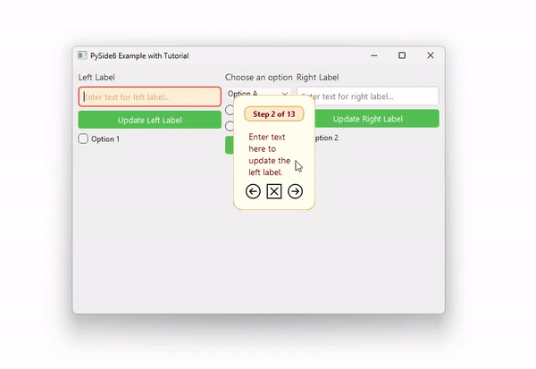

<div align="center">

# QTutorial

A lightweight, interactive tutorial system for PySide6 applications.



</div>

## Description

QTutorial provides an easy way to add step-by-step tutorials to your PySide6 apps. It features element highlighting,
responsive hint positioning, and customizable tutorial steps.

The following sequence diagram illustrates the core workflow of QTutorial:

<div align="center">
  
</div>

## Features

- Interactive tutorial overlay
- UI element highlighting
- Step-by-step guidance
- Customizable tutorial steps
- Responsive hint positioning
- Keyboard navigation support

## Requirements

- Python 3.10+
- PySide6

<details>
<summary>Installation Guide</summary>

1. Clone this repository:
   ```bash
   git clone https://github.com/HardMax71/qtutorial.git
    ```

2. Navigate to the project directory:
    ```bash
    cd qtutorial
    ```

3. Create a virtual environment:
   ```bash
   python -m venv venv
   ```

4. Activate the virtual environment:
    - On Windows:
   ```bash
     venv\Scripts\activate
   ```
    - On macOS and Linux:
   ```bash
      source venv/bin/activate
   ```

5. Install the required packages:

   ```bash
   pip install requirements.txt # or pip install PySide6
   ```

6. Run the application:
   ```bash
    python main.py
    ```

The application will start with the tutorial mode automatically activated.

</details>

## Customization

To customize the tutorial:

1. Modify the `tutorial_steps` list in the `MainWindow` class.
2. Adjust the UI layout in the `MainWindow` class.
3. Customize styles by editing the QSS files:
    - `tutorial_hint.qss`: Style for the tutorial hint box
    - `highlight.qss`: Style for highlighted elements
    - `start_style.qss`: General application style

## Project Structure

```plaintext
qtutorial/
│
├── files/
│   └── example.gif
├── qtutorial/
│   ├── styles/
│   │   ├── highlight.qss
│   │   └── tutorial_hint.qss
│   ├── init.py
│   ├── hint.py
│   ├── tutorial_manager.py
│   └── utils.py
├── .gitignore
├── LICENSE
├── main.py
├── README.md
└── start_style.qss
```

- `files/`: Contains additional resources
  - `example.gif`: Demonstration of the tutorial system
- `qtutorial/`: Core package of the tutorial system
  - `styles/`: QSS stylesheets for the tutorial components
  - `__init__.py`: Package initializer
  - `hint.py`: Implements the tutorial hint widget
  - `tutorial_manager.py`: Manages the tutorial flow
  - `utils.py`: Utility functions including stylesheet loading
- `main.py`: Main application script
- `start_style.qss`: General application stylesheet

## Contributing

Contributions are welcome! Please feel free to submit a Pull Request.

## License

This project is open source and available under the [MIT License](LICENSE).